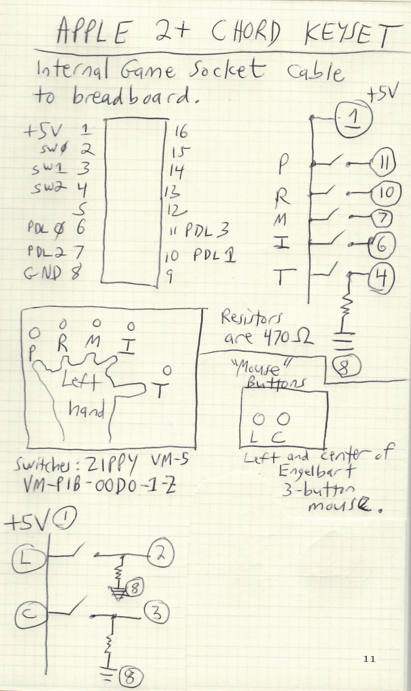

*Ideas for Kansasfest 2024*

A2PKEYSET.dsk has code for testing a Chord Keyset using Doug Engelbart's key mappings, with 2 simulated mouse buttons.
See photo a2pKeysetSchematic.jpg for schematic.

GUITAR.do is experimental code for controlling a Yamaha EZAG using a Passport MIDI interface in slot 2 of a 2+

Thinktank by Living Videotext is the Apple ][ series precursor to what became MORE on the Mac.
- Disk 1 (put in drive 1): https://archive.org/details/Thinktank_disk_1
- Disk 2 (put in drive 2): https://archive.org/details/Thinktank_disk_2
- Manual: https://archive.org/details/ThinkTank_Users_Manual
- MORE v3.1: https://macintoshgarden.org/apps/more-31

*MareMac* directory has modifications to WindsMARE to run on a modern Mac.  It can also run on a Raspberry Pi.
- Demonstration video: https://www.youtube.com/watch?v=AJy6N0oJASQ
- When you are done using your personal MUD, type: @shutdown
- The database for the MUD is stored in the run/db directory with name mdb.
- To back up the database, copy the mdb file to a new name.
- To restore a backup MUD file, or any compatible database file, copy it to run/db/mdb and start bin/netmare
- For information about WindsMARE: https://mare.hoardersheaven.net/
- Help documentation for WindsMARE: https://www.winds.org/helptext/
- Recommended MUD client for people new to MUDs: https://www.mudlet.org/
- To connect to MicroMARE from Mudlet:
  - Server Address: mare.hoardersheaven.net
  - Port: 4201
  - View it as Guest or create a New character if you will be exploring it regularly
  - Note that it contains legacy MUDs that were imported, but certain functions may not work completely.

Youtube Playlist about MUD technology:
- https://www.youtube.com/watch?v=U604QuXfBNA&list=PLOW4_Hp8_912j1Tzu-zN40mpz4OEVzaFH&index=74

To keep up with future research about Doug Engelbart's systems, follow this link:
- https://workflowy.com/s/engelbart-visioning/a6NRhveBIrzJwQ5G#/5ee5ef10ca5c
